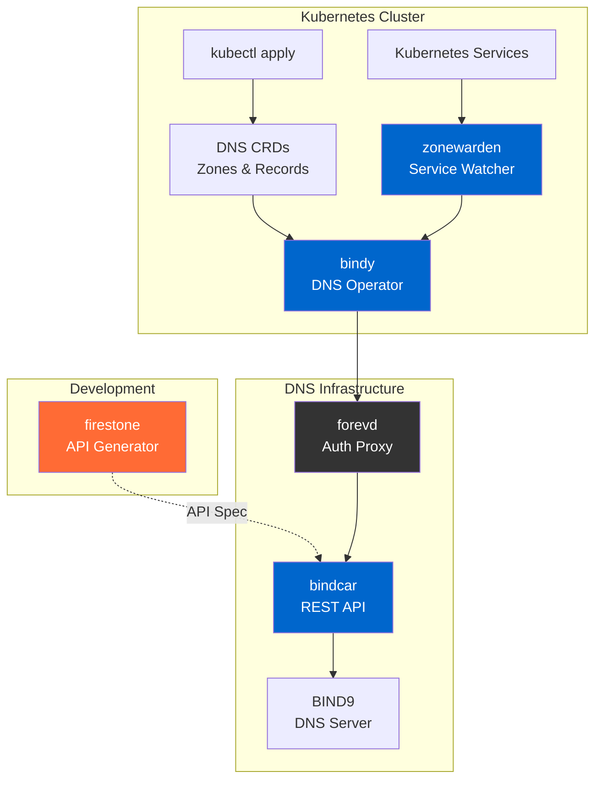

  
API-driven infrastructure management for Kubernetes

  

    <a class="btn btn-lg btn-primary me-3" href="/website/docs/getting-started/">Get Started →</a>
    <a class="btn btn-lg btn-outline-secondary" href="https://github.com/firestoned">View on GitHub</a>
  

---

## Quick Start

Get up and running in minutes:

{}
1. **Install firestone** - `poetry add firestoned`
2. **Define your resource** - Create a JSON Schema for your API resource
3. **Generate your API** - Create OpenAPI specs, CLIs, and client code automatically

**[Follow the Firestone Guide →](/website/docs/firestone/)**
{}

---

## Core Components




🔥

<strong>API Specification Generator</strong>

The heart of Firestoned. Generate OpenAPI, AsyncAPI specs, and CLI tools from JSON Schema resource definitions. Define your resources once, generate everything else automatically.

<strong>Key Features:</strong>
- JSON Schema based workflow
- OpenAPI 3.x & AsyncAPI generation
- Python Click CLI generation
- Code generation via openapi-generator




📚

<strong>Shared Library</strong>

Core library powering firestone and forevd. Provides reusable components for spec generation, validation, and transformation.

<strong>Use Cases:</strong>
- Build custom generators
- Embed in your tools
- Extend functionality
- API automation




🏗️

<strong>Kubernetes DNS Operator</strong>

Kubernetes-native BIND9 DNS management through CRDs. Demonstrates infrastructure-as-code principles with declarative, GitOps-ready DNS.

<strong>Key Features:</strong>
- High-performance Rust operator
- Full DNS record type support
- DNSSEC automation
- High availability






🚗

<strong>BIND9 REST API Sidecar</strong>

REST API for BIND9 zone management. Translates HTTP requests into RNDC commands with built-in authentication and Prometheus metrics.

<strong>Key Features:</strong>
- OpenAPI/Swagger documentation
- ServiceAccount token auth
- Real-time zone operations
- Metrics and monitoring




🛡️

<strong>Service-to-DNS Sync</strong>

Kubernetes controller for automatic DNS record creation. Watch namespaces, sync IPs, and maintain service discovery across clusters.

<strong>Key Features:</strong>
- Automatic DNS registration
- Multi-cluster support
- LoadBalancer integration
- Linkerd mesh ready



---

## Architecture Overview

Understanding how the components work together:

**[Getting Started Guide →](/website/docs/getting-started/)**

---

## Why Firestoned?

{}

<h3>🎯 API-First Development</h3>

Define infrastructure resources once using JSON Schema. Automatically generate OpenAPI specs, AsyncAPI specs, CLIs, and client libraries. No manual API coding required.

<h3>📐 Schema-Driven Consistency</h3>

Single source of truth ensures your API specs, documentation, validation logic, and client code stay in perfect sync. Change the schema, regenerate everything.

<h3>🔧 Developer Experience</h3>

From resource definition to working API in minutes. Includes practical Kubernetes-native examples showing real-world infrastructure-as-code patterns.

{}

---

## Getting Started

Ready to build API-driven infrastructure? Choose your path:

  

    <h3>🚀 Complete Guide</h3>
    
New to Firestoned? Start here for a comprehensive walkthrough from installation to your first API.

    
<strong><a href="/website/docs/getting-started/">Getting Started Guide →</a></strong>

  

  

    <h3>📖 Component Docs</h3>
    
Jump directly to documentation for specific components:

    
<strong><a href="/website/docs/firestone/">firestone</a> | <a href="/website/docs/bindy/">bindy</a> | <a href="/website/docs/bindcar/">bindcar</a></strong>

  

  

    <h3>💬 Community</h3>
    
Get help, report issues, or contribute to the project on GitHub.

    
<strong><a href="https://github.com/firestoned/firestoned">GitHub Repository →</a></strong>

  

