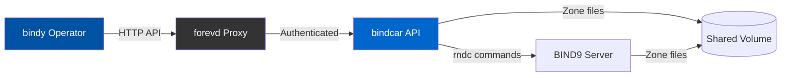
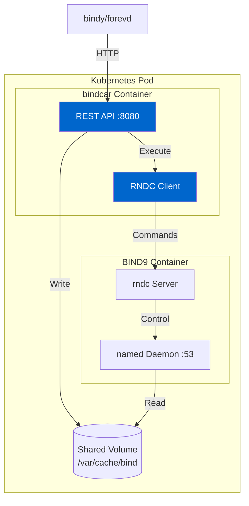

# bindcar

A lightweight HTTP REST API server for managing BIND9 zones via rndc commands.

[Project Repository](https://github.com/firestoned/firestoned/tree/main/bindcar)

## Overview

`bindcar` runs as a sidecar container alongside BIND9, providing a REST interface for zone management operations. It executes `rndc` commands locally and manages zone files on a shared volume.

### How It Fits in the Ecosystem

`bindcar` is a key component in the Firestoned ecosystem:

- **Works with [bindy](/docs/bindy/)** - The bindy operator calls bindcar's API to manage BIND9 zones
- **Secured by [forevd](/docs/forevd/)** - Deploy forevd as an auth proxy in front of bindcar for mTLS/OIDC
- **Generated by [firestone](/docs/firestone/)** - The OpenAPI spec was generated using firestone



**See also:**
- [Ecosystem Overview](/docs/getting-started/) - Complete architecture
- [bindy Documentation](/docs/bindy/) - Kubernetes DNS operator
- [forevd Documentation](/docs/forevd/) - Authentication proxy

## Features

- Zone management via REST API (create, delete, reload, status)
- ServiceAccount token authentication
- Health and readiness endpoints
- Prometheus metrics for monitoring
- Structured JSON logging
- Runs as non-root user with minimal permissions

## Quick Start

### Using Docker

```bash
docker run -d \
  -p 8080:8080 \
  -v /var/cache/bind:/var/cache/bind \
  -e RUST_LOG=info \
  ghcr.io/firestoned/bindcar:latest
```

### Using Kubernetes

```yaml
apiVersion: v1
kind: Pod
metadata:
  name: bind9
spec:
  containers:
  - name: bind9
    image: bind9:latest
    volumeMounts:
    - name: zones
      mountPath: /var/cache/bind
  - name: bindcar
    image: ghcr.io/firestoned/bindcar:latest
    ports:
    - containerPort: 8080
    volumeMounts:
    - name: zones
      mountPath: /var/cache/bind
  volumes:
  - name: zones
    emptyDir: {}
```

## Configuration

Environment variables:

- `BIND_ZONE_DIR` - Directory for zone files (default: `/var/cache/bind`)
- `API_PORT` - API server port (default: `8080`)
- `RNDC_PATH` - Path to rndc binary (default: `/usr/sbin/rndc`)
- `RUST_LOG` - Log level (default: `info`)
- `DISABLE_AUTH` - Disable authentication (default: `false`)

### Authentication

By default, authentication is **enabled** and requires Bearer token authentication for all API endpoints except `/health` and `/ready`.

To disable authentication (e.g., when using a service mesh like Linkerd for authentication):

```bash
# Docker
docker run -d \
  -p 8080:8080 \
  -e DISABLE_AUTH=true \
  ghcr.io/firestoned/bindcar:latest

# Kubernetes
env:
- name: DISABLE_AUTH
  value: "true"
```

**WARNING**: Disabling authentication should ONLY be done in trusted environments where authentication is handled by infrastructure (Linkerd service mesh, API gateway, etc.). Never disable authentication in production without proper network-level security controls.

## API Endpoints

- `GET /api/v1/health` - Health check
- `GET /api/v1/ready` - Readiness check
- `GET /metrics` - Prometheus metrics (no auth required)
- `GET /api/v1/server/status` - BIND9 server status
- `POST /api/v1/zones` - Create zone
- `GET /api/v1/zones` - List zones
- `GET /api/v1/zones/{name}` - Get zone info
- `DELETE /api/v1/zones/{name}` - Delete zone
- `POST /api/v1/zones/{name}/reload` - Reload zone
- `GET /api/v1/zones/{name}/status` - Zone status
- `POST /api/v1/zones/{name}/freeze` - Freeze zone
- `POST /api/v1/zones/{name}/thaw` - Thaw zone
- `POST /api/v1/zones/{name}/notify` - Notify secondaries

For complete API documentation with interactive Swagger UI, see the [OpenAPI specification](https://github.com/firestoned/firestoned/tree/main/bindcar/docs).

---

## Architecture

### Sidecar Pattern

bindcar runs alongside BIND9 in the same pod, sharing a volume for zone files:



### Security Model

1. **Network Isolation** - Only accessible within Kubernetes cluster
2. **Authentication** - Bearer token validation (ServiceAccount tokens)
3. **Authorization** - Token claims validated against Kubernetes RBAC
4. **Non-root** - Runs as UID 1000, minimal permissions
5. **Service Mesh** - Use [Linkerd](/docs/getting-started/#pattern-3-secure-dns-api-access) for mTLS between bindy and bindcar

---

## Common Patterns

### Pattern 1: With bindy Operator

bindcar is automatically deployed when using bindy:

```yaml
apiVersion: bindy.firestoned.io/v1alpha1
kind: Bind9Instance
metadata:
  name: primary-dns-1
spec:
  # bindcar sidecar is automatically injected
  # No manual configuration needed
```

**[Learn more about bindy →](/docs/bindy/)**

### Pattern 2: With forevd Auth Proxy

Add forevd for enhanced authentication:

```yaml
apiVersion: v1
kind: Pod
metadata:
  name: dns-server
spec:
  containers:
  - name: bind9
    image: bind9:latest
  - name: bindcar
    image: ghcr.io/firestoned/bindcar:latest
    env:
    - name: DISABLE_AUTH
      value: "true"  # forevd handles auth
  - name: forevd
    image: ghcr.io/firestoned/forevd:latest
    # mTLS configuration for bindcar backend
```

**[Learn more about forevd →](/docs/forevd/)**

### Pattern 3: Standalone Deployment

Use bindcar independently for custom integrations:

```bash
# Start BIND9
docker run -d --name bind9 \
  -v bind-zones:/var/cache/bind \
  bind9:latest

# Start bindcar in same network
docker run -d --name bindcar \
  --network container:bind9 \
  -v bind-zones:/var/cache/bind \
  -e DISABLE_AUTH=true \
  ghcr.io/firestoned/bindcar:latest

# Create a zone via API
curl -X POST http://localhost:8080/api/v1/zones \
  -H "Content-Type: application/json" \
  -d '{"name": "example.com", "class": "IN"}'
```

---

## Troubleshooting

### bindcar Not Starting

{}
Pod shows `CrashLoopBackOff` or bindcar logs show startup errors
{}

**Check:**

1. **rndc path is correct:**
   ```bash
   kubectl exec -it <pod> -c bindcar -- which rndc
   # Should return: /usr/sbin/rndc
   ```

2. **Shared volume exists:**
   ```bash
   kubectl describe pod <pod>
   # Look for volume mounts in both containers
   ```

3. **Permissions on zone directory:**
   ```bash
   kubectl exec -it <pod> -c bindcar -- ls -la /var/cache/bind
   # Should be writable by UID 1000
   ```

### API Returns 401 Unauthorized

{}
API calls fail with `401 Unauthorized` even with valid tokens
{}

**Solutions:**

1. **Check authentication is enabled:**
   ```bash
   kubectl get pod <pod> -o yaml | grep DISABLE_AUTH
   # Should be empty or "false"
   ```

2. **Verify ServiceAccount token:**
   ```bash
   # Get token from bindy operator logs
   kubectl logs -n dns-system deployment/bindy | grep token
   ```

3. **Or disable auth if using service mesh:**
   ```yaml
   env:
   - name: DISABLE_AUTH
     value: "true"
   ```

### Zone Operations Fail

{}
API returns 500 errors when creating/deleting zones
{}

**Check:**

1. **BIND9 is running:**
   ```bash
   kubectl exec -it <pod> -c bind9 -- named -v
   ```

2. **rndc is accessible:**
   ```bash
   kubectl exec -it <pod> -c bindcar -- rndc status
   # Should show BIND9 server status
   ```

3. **Zone directory is writable:**
   ```bash
   kubectl exec -it <pod> -c bindcar -- touch /var/cache/bind/test
   # Should succeed without errors
   ```

4. **Check bindcar logs:**
   ```bash
   kubectl logs <pod> -c bindcar -f
   # Look for rndc command failures
   ```

### Metrics Not Appearing

{}
Prometheus not scraping bindcar metrics
{}

**Verify:**

1. **Metrics endpoint is accessible:**
   ```bash
   kubectl exec -it <pod> -c bindcar -- curl localhost:8080/metrics
   # Should return Prometheus-format metrics
   ```

2. **ServiceMonitor is configured:**
   ```yaml
   apiVersion: monitoring.coreos.com/v1
   kind: ServiceMonitor
   metadata:
     name: bindcar
   spec:
     selector:
       matchLabels:
         app: bindcar
     endpoints:
     - port: http
       path: /metrics
   ```

---

## Performance Tuning

### Recommended Resource Limits

```yaml
resources:
  requests:
    cpu: 100m
    memory: 64Mi
  limits:
    cpu: 500m
    memory: 128Mi
```

### Scaling Considerations

- bindcar scales with BIND9 - one bindcar per BIND9 instance
- Stateless - can restart without data loss
- Low overhead - minimal CPU and memory usage
- Fast response times - <10ms for most operations

---

## Next Steps

- **[Deploy with bindy](/docs/bindy/)** - Use bindcar automatically via the operator
- **[Secure with forevd](/docs/forevd/)** - Add authentication and authorization
- **[View API Docs](https://github.com/firestoned/firestoned/tree/main/bindcar/docs)** - Complete OpenAPI specification
- **[GitHub Repository](https://github.com/firestoned/firestoned/tree/main/bindcar)** - Source code and examples