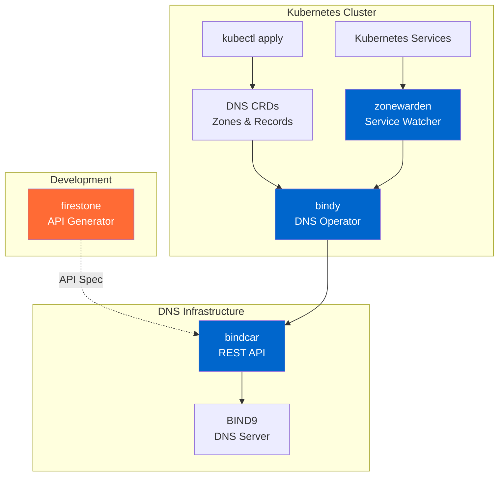

# Getting Started with Firestoned

Welcome to the Firestoned ecosystem! This guide will walk you through everything you need to know to build API-driven infrastructure, starting with firestone - the core API specification generator.

## What You'll Learn

- **[Ecosystem Overview](#ecosystem-overview)** - Understand how all components work together
- **[Quick Start](#quick-start)** - Build your first API with firestone in 5 minutes
- **[Next Steps](#next-steps)** - Explore the DNS utilities and advanced features

---

## Ecosystem Overview

Firestoned is a toolkit for building API-driven infrastructure, centered around **firestone** - an innovative API specification generator. The ecosystem demonstrates infrastructure-as-code principles through practical Kubernetes-native DNS management utilities.

## Components

### Core: API Generation

- **firestone**: The heart of Firestoned. Generates OpenAPI/AsyncAPI specifications and CLI tools from JSON Schema resource definitions. Define your resources once, generate everything else automatically.
- **firestone-lib**: Shared library powering firestone. Provides reusable components for spec generation, validation, and transformation.

### Utilities: Kubernetes-Native DNS Management

These components demonstrate the power of API-driven infrastructure by implementing declarative DNS management:

- **bindy**: Kubernetes operator managing BIND9 DNS through Custom Resource Definitions (CRDs). Demonstrates how to build infrastructure operators with declarative APIs.
- **bindcar**: REST API sidecar for BIND9 zone management. Its OpenAPI spec is generated using firestone, showing the API generation workflow in action.
- **zonewarden**: Kubernetes controller for automatic service-to-DNS synchronization. Shows how to build automation that bridges Kubernetes services with external systems.

## How It Works Together

The DNS utilities showcase a complete implementation of API-driven infrastructure management:

### Visualization



### Example Workflow: DNS Management

This workflow demonstrates how the utilities work together for DNS infrastructure:

1. **API Definition (Development Time)**: Use `firestone` to generate the OpenAPI specification for `bindcar`'s REST API from JSON Schema resource definitions.
2. **Declarative Management**: Define desired DNS state by creating Kubernetes CRDs (e.g., `kubectl apply -f zone.yaml`).
3. **Operator Reconciliation**: The `bindy` operator detects new CRDs and prepares API calls.
4. **Automated Discovery**: `zonewarden` watches Kubernetes Services and automatically creates DNS records for them.
5. **API Execution**: `bindy` calls the `bindcar` REST API to update the DNS server.
6. **DNS Updates**: `bindcar` translates API calls into BIND9 rndc commands.

This demonstrates a fully declarative, GitOps-friendly approach to infrastructure management using APIs generated by firestone.

---

## Quick Start

Build your first API with firestone in 5 minutes:

### Step 1: Install firestone

```bash
# Install using poetry (note: package is 'firestoned', import as 'firestone')
poetry add firestoned

# Verify installation
poetry run firestone --version
```

### Step 2: Define Your Resource

Create a file `book-resource.yaml` that defines a simple book management API:

```yaml
name: book
description: Book resource for library management API
version: 1.0
version_in_path: false

methods:
  resource: [get, post]
  instance: [get, put, delete]

schema:
  type: array
  key:
    name: book_id
    schema:
      type: string
      description: Unique identifier for the book
  items:
    type: object
    properties:
      title:
        type: string
        description: Book title
      author:
        type: string
        description: Book author
      isbn:
        type: string
        description: ISBN number
      published_year:
        type: integer
        description: Year of publication
    required: [title, author, isbn]
```

### Step 3: Generate OpenAPI Specification

```bash
# Generate OpenAPI spec
firestone generate \
    --title 'Library Management API' \
    --description 'RESTful API for managing library books' \
    --resources book-resource.yaml \
    openapi > library-api.yaml

# Optional: Generate with Swagger UI server
firestone generate \
    --title 'Library Management API' \
    --resources book-resource.yaml \
    openapi --ui-server
```

### Step 4: Generate Client Code and CLI

```bash
# Generate Python client using openapi-generator
openapi-generator generate \
    -i library-api.yaml \
    -g python \
    -o library-client/

# Generate a Python Click-based CLI
firestone generate \
    --title 'Library CLI' \
    --resources book-resource.yaml \
    cli \
    --pkg library_cli \
    --client-pkg library_client > library_cli.py
```

**Congratulations!** 🎉 You've just built a complete API specification, client library, and CLI tool from a single resource definition.

---

## Next Steps

### Master firestone

Explore advanced features of the API generator:
- [firestone Documentation](/docs/firestone/)
- [AsyncAPI Generation](/docs/firestone/#asyncapi-generation)
- [Custom Resource Patterns](/docs/firestone/)

### Explore firestone-lib

Build custom generators and tools:
- [firestone-lib Documentation](/docs/firestone/)
- [Embedding in Your Applications](/docs/firestone/)

### See It In Action: DNS Utilities

See how firestone powers real-world infrastructure:
- [bindy Kubernetes Operator](/docs/bindy/)
- [bindcar REST API](/docs/bindcar/)
- [zonewarden Service Discovery](/docs/zonewarden/)

---

## Common Patterns

### Pattern 1: API-First Resource Design

Define infrastructure resources using JSON Schema, generate everything else:

```yaml
# resource.yaml - Your single source of truth
name: server
description: Server management resource
schema:
  type: array
  key:
    name: server_id
  items:
    type: object
    properties:
      hostname:
        type: string
      ip_address:
        type: string
      status:
        type: string
        enum: [active, maintenance, offline]
```

Then generate:
- OpenAPI spec: `firestone generate --resources resource.yaml openapi`
- CLI tool: `firestone generate --resources resource.yaml cli`
- Client libraries using openapi-generator

### Pattern 2: GitOps Infrastructure Management

Store resource definitions and generated specs in Git for full infrastructure-as-code:

```bash
# Repository structure
infrastructure/
├── resources/
│   ├── server.yaml
│   ├── network.yaml
│   └── storage.yaml
├── generated/
│   ├── openapi/
│   └── cli/
└── deployments/
    ├── production/
    └── staging/
```

### Pattern 3: Kubernetes Operator Integration

Use firestone-generated APIs in Kubernetes operators (like the DNS utilities):

- Define API resources with JSON Schema
- Generate OpenAPI specs with firestone
- Build operators that consume the generated APIs
- Deploy declaratively with kubectl

---

## Troubleshooting

### Installation Issues

If `poetry add firestoned` fails:
```bash
# Ensure you have Python 3.9+
python --version

# Ensure poetry is installed
poetry --version

# If poetry is not installed, install it
curl -sSL https://install.python-poetry.org | python3 -

# Install with verbose output
poetry add -vvv firestoned
```

### Generation Errors

If OpenAPI generation fails, validate your resource schema:
```bash
# Enable debug logging
firestone --debug generate --resources resource.yaml openapi

# Check for JSON Schema validation errors
# Ensure required fields are present: name, description, schema
```

### Import vs Package Name

Remember: Install as `firestoned`, import as `firestone`:
```bash
poetry add firestoned  # Package name on PyPI
```
```python
import firestone  # Module name in Python
```

### Need Help?

- **[GitHub Issues](https://github.com/firestoned/firestoned/issues)** - Report bugs or request features
- **[GitHub Discussions](https://github.com/firestoned/firestoned/discussions)** - Ask questions
- **[Documentation](/docs/)** - Explore component-specific docs
