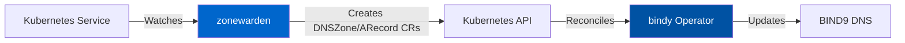
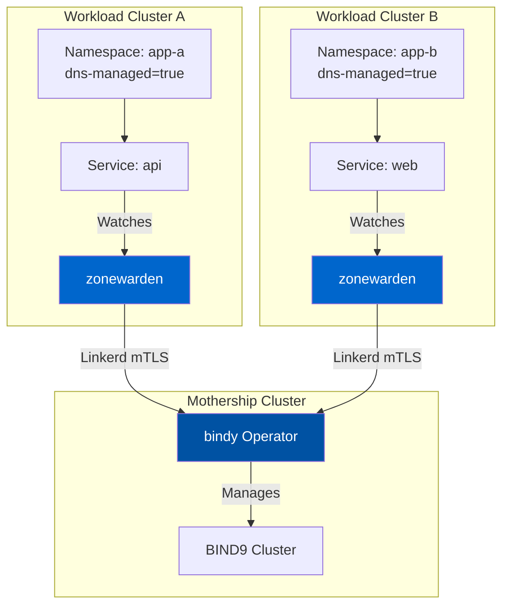

# zonewarden

`zonewarden` is a Kubernetes controller that watches services in managed namespaces and syncs DNS records to [bindy](../bindy) (bind9 API).

[Project Repository](https://github.com/firestoned/firestoned/tree/main/zonewarden)

## Overview

`zonewarden` bridges Kubernetes Services to DNS by:

1. Watching namespaces labeled with `dns-managed=true`
2. Monitoring services within those namespaces
3. Syncing service IPs to BIND9 zones via the [bindy](/docs/bindy/) API

This enables automatic DNS registration for services, particularly useful for LoadBalancer services in multi-cluster environments.

### How It Fits in the Ecosystem

`zonewarden` completes the automation story:

- **Watches** Kubernetes Services automatically
- **Creates DNS records** via [bindy](/docs/bindy/) operator
- **Works across clusters** using Linkerd service mesh
- **Eliminates manual DNS** - No more hand-editing zone files!



**See also:**
- **[bindy Documentation](/docs/bindy/)** - The operator that zonewarden integrates with
- **[Ecosystem Overview](/docs/getting-started/)** - Complete architecture

## Architecture

`zonewarden` runs in a workload cluster and communicates with `bindy` in a central "mothership" cluster.

```
┌─────────────────────────────────────────────────────────────────┐
│                     Workload Cluster                            │
│  ┌─────────────┐    ┌─────────────────┐    ┌─────────────────┐  │
│  │  Namespace  │    │   zonewarden    │    │    Linkerd      │  │
│  │  (labeled)  │───▶│   Controller    │───▶│   (mTLS)        │  │
│  │             │    │                 │    │                 │  │
│  │  Services   │    │  - Watch NS     │    └────────┬────────┘  │
│  └─────────────┘    │  - Watch Svc    │             │           │
│                     │  - Sync DNS     │             │           │
│                     └─────────────────┘             │           │
└────────────────────────────────────────────────────┼───────────┘
                                                     │
                              ┌──────────────────────┘
                              │ Linkerd Multi-cluster
                              ▼
┌─────────────────────────────────────────────────────────────────┐
│                    k0rdent Mothership                           │
│  ┌─────────────────┐    ┌─────────────────┐                     │
│  │      bindy      │    │     bind9       │                     │
│  │      API        │───▶│   Instances     │                     │
│  │                 │    │                 │                     │
│  └─────────────────┘    └─────────────────┘                     │
└─────────────────────────────────────────────────────────────────┘
```

## Usage

### 1. Label namespaces for DNS management

```bash
kubectl label namespace my-app dns-managed=true
```

### 2. Create a ServiceDNSConfig

```yaml
apiVersion: dns.cf.rbccm.com/v1alpha1
kind: ServiceDNSConfig
metadata:
  name: default
  namespace: my-app
spec:
  zoneRef:
    name: apps.rbccm.com
    namespace: bindy-system
  serviceTypes:
    - LoadBalancer
  recordNameTemplate: "{service}.{namespace}"
```

### 3. Deploy services

Any LoadBalancer service in the namespace will automatically get a DNS record:

```yaml
apiVersion: v1
kind: Service
metadata:
  name: my-api
  namespace: my-app
spec:
  type: LoadBalancer
  ports:
    - port: 443
  selector:
    app: my-api
```

This creates a DNS record: `my-api.my-app.apps.rbccm.com`

## ServiceDNSConfig Spec

| Field | Description | Default |
|-------|-------------|---------|
| `zoneRef.name` | Name of the DNSZone CR | (required) |
| `zoneRef.namespace` | Namespace of the DNSZone | (same namespace) |
| `serviceSelector.matchLabels` | Label selector for services | (all services) |
| `recordNameTemplate` | Template for record names | `{service}.{namespace}` |
| `recordType` | DNS record type (A/CNAME) | `A` |
| `serviceTypes` | Service types to sync | `[LoadBalancer]` |

---

## Troubleshooting

### zonewarden Not Creating Records

{}
Services are created but DNS records don't appear in BIND9
{}

**Check:**

1. **Namespace is labeled:**
   ```bash
   kubectl get namespace my-app -o yaml | grep dns-managed
   # Should show: dns-managed: "true"
   ```

2. **ServiceDNSConfig exists:**
   ```bash
   kubectl get servicednsconfig -n my-app
   # Should show at least one config
   ```

3. **bindy is running:**
   ```bash
   kubectl get pods -n dns-system
   # bindy pod should be Running
   ```

4. **Check zonewarden logs:**
   ```bash
   kubectl logs -n dns-system deployment/zonewarden -f
   # Look for reconciliation errors
   ```

### Services Not Detected

{}
New services created but zonewarden doesn't process them
{}

**Verify:**

1. **Service type matches config:**
   ```bash
   kubectl get svc my-service -o yaml | grep "type:"
   # Should match serviceTypes in ServiceDNSConfig
   ```

2. **Service has external IP:**
   ```bash
   kubectl get svc my-service
   # EXTERNAL-IP should not be <pending>
   ```

3. **Label selector matches:**
   ```bash
   # If using serviceSelector in config
   kubectl get svc my-service --show-labels
   ```

### Cross-Cluster Communication Fails

{}
zonewarden can't reach bindy API in mothership cluster
{}

**Solutions:**

1. **Verify Linkerd is installed:**
   ```bash
   linkerd check
   # Should pass all checks
   ```

2. **Check service mirror:**
   ```bash
   kubectl get svc -n dns-system | grep bindy
   # Should show mirrored service from mothership
   ```

3. **Test connectivity:**
   ```bash
   kubectl run -it --rm debug --image=curlimages/curl --restart=Never -- \
     curl http://bindy.dns-system.svc.cluster.local
   ```

---

## Architecture Details

### Multi-Cluster Setup

zonewarden enables DNS automation across multiple Kubernetes clusters:



### Record Naming

zonewarden uses templates to generate DNS record names:

**Default template:** `{service}.{namespace}`

**Examples:**
- Service `api` in namespace `production` → `api.production.example.com`
- Service `web` in namespace `staging` → `web.staging.example.com`

**Custom template:** `{service}-{namespace}-cluster-a`

**Result:**
- Service `api` in namespace `prod` → `api-prod-cluster-a.example.com`

---

## Common Patterns

### Pattern 1: Per-Namespace DNS Zones

Create separate zones for each namespace:

```yaml
---
# Namespace configuration
apiVersion: v1
kind: Namespace
metadata:
  name: production
  labels:
    dns-managed: "true"
---
# Zone for this namespace
apiVersion: bindy.firestoned.io/v1alpha1
kind: DNSZone
metadata:
  name: production-zone
  namespace: dns-system
spec:
  zoneName: production.example.com
---
# Auto-register services
apiVersion: dns.cf.rbccm.com/v1alpha1
kind: ServiceDNSConfig
metadata:
  name: auto-dns
  namespace: production
spec:
  zoneRef:
    name: production-zone
    namespace: dns-system
  recordNameTemplate: "{service}"
```

### Pattern 2: Selective Service Registration

Only register services with specific labels:

```yaml
apiVersion: dns.cf.rbccm.com/v1alpha1
kind: ServiceDNSConfig
metadata:
  name: public-services
  namespace: production
spec:
  zoneRef:
    name: public-zone
  serviceSelector:
    matchLabels:
      expose: "external"
  serviceTypes:
    - LoadBalancer
```

Then label services to expose:

```yaml
apiVersion: v1
kind: Service
metadata:
  name: api
  labels:
    expose: "external"  # Will be registered
spec:
  type: LoadBalancer
```

### Pattern 3: Multi-Region with Geo-DNS

Use different record names per region:

```yaml
# US region
apiVersion: dns.cf.rbccm.com/v1alpha1
kind: ServiceDNSConfig
metadata:
  name: us-services
  namespace: apps
spec:
  zoneRef:
    name: global-zone
  recordNameTemplate: "{service}.us"
---
# EU region
apiVersion: dns.cf.rbccm.com/v1alpha1
kind: ServiceDNSConfig
metadata:
  name: eu-services
  namespace: apps
spec:
  zoneRef:
    name: global-zone
  recordNameTemplate: "{service}.eu"
```

**Result:**
- `api.us.example.com` → US cluster IP
- `api.eu.example.com` → EU cluster IP

---

## Next Steps

- **[Install bindy first](/docs/bindy/)** - Required before zonewarden
- **[Ecosystem Overview](/docs/getting-started/)** - Understand the complete architecture
- **[GitHub Repository](https://github.com/firestoned/firestoned/tree/main/zonewarden)** - Source code (architecture only currently)