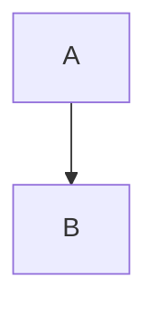

# Phase 1: bindy Migration (Weeks 2-3)

**Status:** Not Started
**Owner:** TBD
**Duration:** 2 weeks
**Depends On:** Phase 0 (Foundation)

---

## Goal

Migrate bindy's 94-page mdBook documentation to Hugo while preserving all content, diagrams, and auto-generated documentation.

---

## Prerequisites

- Phase 0 completed (Hugo site functional)
- bindy mdBook site currently at `bindy/docs/src/`
- Familiarity with bindy documentation structure

---

## Tasks

### 1. Analyze Current mdBook Structure

Review `bindy/docs/src/SUMMARY.md` to understand:
- Section hierarchy
- Page organization
- Cross-references
- Special content (diagrams, code blocks, etc.)

**Document the mapping:**
```
mdBook SUMMARY.md         →  Hugo Directory Structure
├── Installation/         →  installation/
│   ├── Prerequisites     →  prerequisites.md
│   └── Quick Start       →  quickstart.md
├── Concepts/             →  concepts/
└── ...
```

---

### 2. Create Hugo Directory Structure

```bash
cd /home/brad/firestoned/bindy/docs
mkdir -p hugo
cd hugo

# Create directory structure based on mdBook sections
mkdir -p installation
mkdir -p concepts
mkdir -p guide
mkdir -p development
mkdir -p advanced
mkdir -p operations
mkdir -p reference
```

---

### 3. Convert mdBook Pages to Hugo Format

For each markdown file in `bindy/docs/src/`:

#### 3.1 Copy File

```bash
cp src/installation/prerequisites.md hugo/installation/prerequisites.md
```

#### 3.2 Add Hugo Front Matter

At the top of each file, add:

```yaml
---
title: "Prerequisites"
linkTitle: "Prerequisites"
weight: 1
description: >
  Requirements for installing bindy
---
```

**Weight Guidelines:**
- Use increments of 10: 10, 20, 30...
- Allows inserting pages later: 15, 25, etc.
- Lower numbers appear first

#### 3.3 Create Section Index Files

For each directory, create `_index.md`:

```yaml
---
title: "Installation"
linkTitle: "Installation"
weight: 10
description: >
  How to install and configure bindy
---

# Installation

This section covers bindy installation and initial setup.
```

---

### 4. Update Internal Links

mdBook uses relative links like:
```markdown
See [Architecture](../concepts/architecture.md)
```

Hugo uses:
```markdown
See [Architecture]()
```

**Find and replace:**
```bash
# In hugo/ directory
find . -name "*.md" -type f -exec sed -i 's/](\.\.\//]({{< relref "..\//g' {} \;
find . -name "*.md" -type f -exec sed -i 's/\.md)/\/" >}})/g' {} \;
```

---

### 5. Convert Mermaid Diagrams

#### 5.1 Create Mermaid Shortcode

Create `website/layouts/shortcodes/mermaid.html`:

```html
<div class="mermaid">
{{ .Inner }}
</div>
{{ if not (.Page.Scratch.Get "mermaid") }}
  {{ .Page.Scratch.Set "mermaid" true }}
  <script type="module">
    import mermaid from 'https://cdn.jsdelivr.net/npm/mermaid@10/dist/mermaid.esm.min.mjs';
    mermaid.initialize({ startOnLoad: true, theme: 'default' });
  </script>
{{ end }}
```

#### 5.2 Convert mdBook Mermaid Syntax

mdBook:
````markdown

````

Hugo:
````markdown

graph TB
  A --> B

````

**Automated conversion:**
```bash
find hugo/ -name "*.md" -type f -exec sed -i 's/```mermaid//g' {} \;
find hugo/ -name "*.md" -type f -exec sed -i '//,/```/{s/```//}' {} \;
```

---

### 6. Set Up Content Mount

Add to `website/config/_default/module.toml`:

```toml
# Mount bindy Hugo content
[[mounts]]
  source = "../bindy/docs/hugo"
  target = "content/docs/bindy"

# Mount bindy rustdoc
[[mounts]]
  source = "../bindy/target/doc"
  target = "static/api/bindy/rustdoc"
```

---

### 7. Integrate Auto-Generated Documentation

#### 7.1 Add Makefile Target to bindy

Edit `bindy/Makefile`, add:

```makefile
docs-hugo-prepare: ## Prepare Hugo content
	@echo "Preparing bindy documentation for Hugo..."
	@mkdir -p docs/hugo/reference
	@echo "Generating CRD API reference..."
	@cargo run --bin crddoc > docs/hugo/reference/api.md
	@echo "Building rustdoc..."
	@cargo doc --no-deps --all-features
	@echo "Hugo preparation complete"
```

#### 7.2 Enhance crddoc for Hugo

Edit `bindy/src/bin/crddoc.rs` to add front matter:

```rust
fn main() {
    // Print Hugo front matter
    println!("---");
    println!("title: \"CRD API Reference\"");
    println!("linkTitle: \"API Reference\"");
    println!("weight: 100");
    println!("description: >");
    println!("  Complete API reference for bindy Custom Resource Definitions");
    println!("---");
    println!();

    // Existing crddoc output...
}
```

#### 7.3 Create Rustdoc Link Page

Create `bindy/docs/hugo/reference/rustdoc.md`:

```markdown
---
title: "Rust API Documentation"
linkTitle: "Rust API"
weight: 110
description: >
  Rust API documentation for bindy internals
---

# Rust API Documentation

Complete Rust API documentation for bindy is available here:

**[View Rust API Docs →](/api/bindy/rustdoc/bindy/)**

This documentation is auto-generated from the Rust source code and covers:
- Internal modules and functions
- Type definitions
- Trait implementations
- Examples
```

---

### 8. Update website Makefile

Edit `website/Makefile`, update `prepare-all`:

```makefile
prepare-all: ## Prepare all project docs
	@echo "Preparing bindy documentation..."
	@cd ../bindy && $(MAKE) docs-hugo-prepare
	# Add more projects in future phases
```

---

### 9. Create bindy Overview Page

Create `bindy/docs/hugo/_index.md`:

```markdown
---
title: "bindy"
linkTitle: "bindy"
weight: 10
description: >
  Kubernetes operator for managing BIND9 DNS infrastructure
---

# bindy - BIND9 DNS Controller for Kubernetes

bindy is a high-performance Kubernetes operator that manages BIND9 DNS infrastructure through Custom Resource Definitions (CRDs).

## Quick Links

- [Installation](installation/)
- [Quick Start](installation/quickstart/)
- [Concepts](concepts/)
- [User Guide](guide/)
- [API Reference](reference/api/)

## Key Features

- 🚀 **High Performance** - Native Rust with async/await
- 🏗️ **Cluster Management** - Manage logical DNS clusters
- 🔄 **Dynamic DNS Updates** - Real-time updates via RNDC
- 📝 **Multi-Record Types** - A, AAAA, CNAME, MX, TXT, NS, SRV, CAA
- 🎯 **Declarative Configuration** - GitOps-ready
- 🔒 **Security First** - Non-root containers, RBAC, mTLS
- 🏆 **High Availability** - Leader election with automatic failover

## Architecture


graph TB
    User[User] -->|kubectl apply| K8s[Kubernetes API]
    K8s --> Bindy[bindy Controller]
    Bindy -->|RNDC| BIND9[BIND9 Instances]
    BIND9 -->|DNS Queries| Clients[DNS Clients]

```

---

### 10. Test Migration

```bash
cd website
make clean
make serve
```

Verify:
1. Navigate to http://localhost:1313/docs/bindy/
2. Check all 94 pages are accessible
3. Verify navigation hierarchy
4. Test search functionality
5. Verify Mermaid diagrams render
6. Check CRD API reference generates
7. Verify rustdoc links work

---

## Content Checklist

Review each section and verify migration:

### Installation (5 pages)
- [ ] installation/_index.md
- [ ] installation/prerequisites.md
- [ ] installation/installation.md
- [ ] installation/quickstart.md
- [ ] installation/crds.md

### Concepts (8 pages)
- [ ] concepts/_index.md
- [ ] concepts/architecture.md
- [ ] concepts/crds.md
- [ ] concepts/bind9cluster.md
- [ ] concepts/bind9instance.md
- [ ] concepts/dnszone.md
- [ ] concepts/records.md
- [ ] ...

### Guide (16 pages)
- [ ] guide/_index.md
- [ ] guide/creating-infrastructure.md
- [ ] guide/creating-zones.md
- [ ] guide/managing-records.md
- [ ] ...

### Development (11 pages)
- [ ] development/_index.md
- [ ] development/building.md
- [ ] development/testing.md
- [ ] ...

### Advanced (12 pages)
- [ ] advanced/_index.md
- [ ] advanced/ha.md
- [ ] advanced/dnssec.md
- [ ] ...

### Operations (13 pages)
- [ ] operations/_index.md
- [ ] operations/configuration.md
- [ ] operations/monitoring.md
- [ ] ...

### Reference (12 pages)
- [ ] reference/_index.md
- [ ] reference/api.md (auto-generated)
- [ ] reference/rustdoc.md
- [ ] ...

---

## Success Criteria

- [ ] All 94 pages migrated to Hugo format
- [ ] Navigation hierarchy matches mdBook
- [ ] All internal links functional
- [ ] Mermaid diagrams render correctly
- [ ] CRD documentation auto-generates via `make docs-hugo-prepare`
- [ ] Rustdoc accessible at `/api/bindy/rustdoc/`
- [ ] Search finds bindy content
- [ ] mdBook site still functional (preserved in `docs/src/`)
- [ ] No broken links (verified with htmltest)
- [ ] Mobile responsive layout works

---

## Rollback Plan

If migration encounters issues:

1. **Remove content mount** from `website/config/_default/module.toml`
2. **Keep mdBook as primary** - `bindy/docs/src/` remains unchanged
3. **Debug offline** - Fix Hugo content in `bindy/docs/hugo/`
4. **Re-add mount** when issues resolved

mdBook site remains functional throughout migration.

---

## Deliverables

1. ✅ Complete Hugo directory structure in `bindy/docs/hugo/`
2. ✅ All 94 pages with front matter
3. ✅ Content mount configured in module.toml
4. ✅ Makefile target for doc preparation
5. ✅ Auto-generated CRD documentation
6. ✅ Rustdoc integration
7. ✅ Mermaid diagrams converted
8. ✅ All links updated and verified

---

## Next Phase

**[Phase 2: zonewarden Documentation →](phase-2-zonewarden.md)**

Create zonewarden documentation from README and architecture diagrams.
